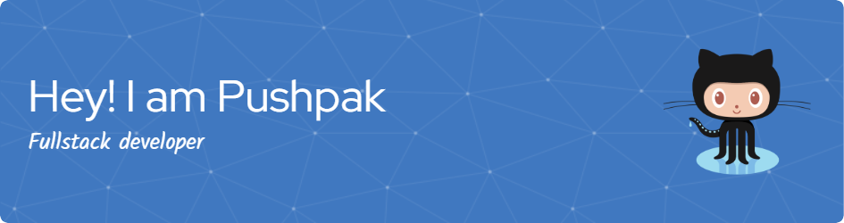

### Hi there 👋

<!--
**PushpakRaut/PushpakRaut** is a ✨ _special_ ✨ repository because its `README.md` (this file) appears on your GitHub profile.

Here are some ideas to get you started:

- 🔭 I’m currently working on ...
- 🌱 I’m currently learning ...
- 👯 I’m looking to collaborate on ...
- 🤔 I’m looking for help with ...
- 💬 Ask me about ...
- 📫 How to reach me: ...
- 😄 Pronouns: ...
- ⚡ Fun fact: ...
-->

<h1> Hello Fellow < Developers/ >!  </h1>

 Hi! My name is Pushapk Raut. Thank You for taking the time to view my GitHub Profile : 

<h2> About Me </h2>

- 🔭 I’m currently working on react JS projects, my skills.  

- 🌱 I’m currently learning React JS, Redux 

- 👯 I’m looking to collaborate on Projects, Tech Articles 

- 💬 Talk to me about Freelancing Opportunites, Open Source, react JS open source projects or paid Projects. 
  

<h2> Skills  </h2>

<h2> Connect with me  </h2>
 
 

